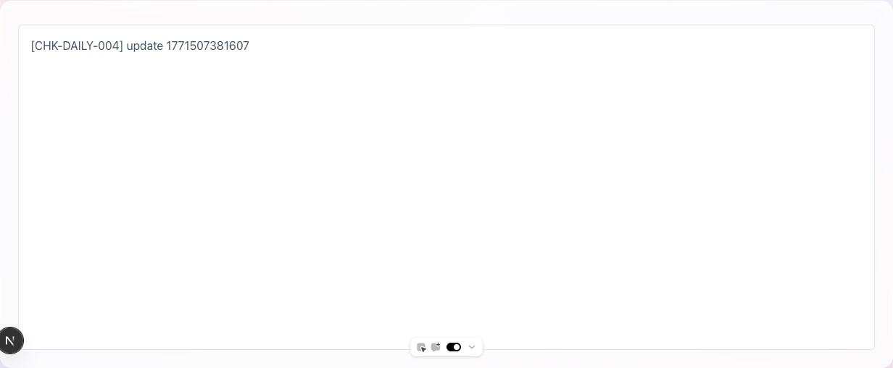
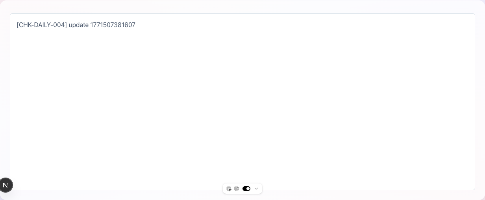
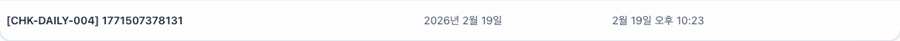
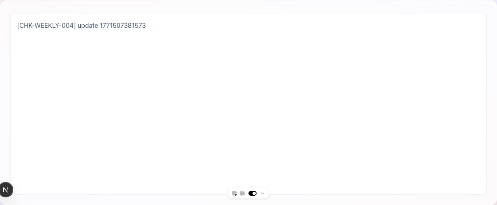
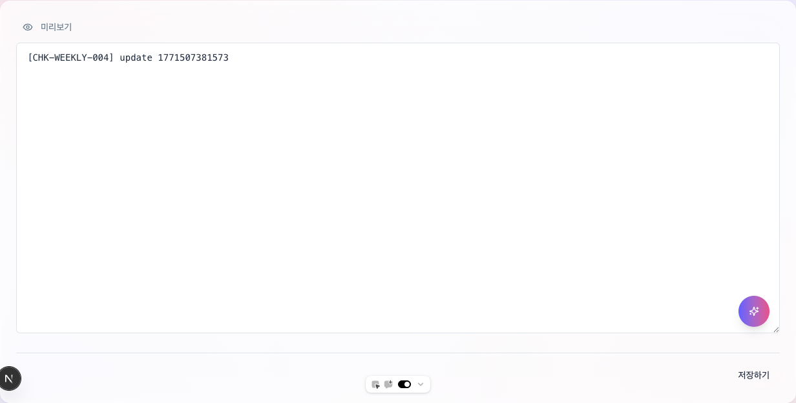
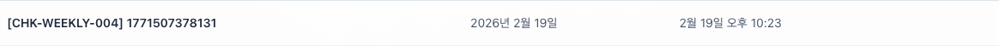

# QA 테스트 결과 (Snippet High + API Key) — 2026-02-19

## 1) 테스트 목적
Daily/Weekly Snippet의 High 시나리오를 검증하고, 신규 범위(설정에서 발급한 API key로 Daily/Weekly API 사용)를 포함해 회귀 여부를 확인합니다.

## 2) 실행 범위
- 대상 스펙
  - `apps/client/tests/e2e/snippets/daily.high.spec.ts`
  - `apps/client/tests/e2e/snippets/weekly.high.spec.ts`
- 포함 항목
  - Daily/Weekly 기본 작성/수정/재조회
  - 과거 항목 readOnly UI + 저장 차단(403)
  - 컷오프 경계(08:59/09:00, 월요일 09:00) 전후 편집 가능 여부 전환
  - **신규**: 설정 화면에서 발급한 API key로 Daily/Weekly API(create/list/update/get) 호출

## 3) 실행 명령
```bash
npm --prefix "/Users/namjookim/projects/gcs-mono/apps/client" run test:e2e:high -- --grep "CHK-(DAILY|WEEKLY)-004"
npm --prefix "/Users/namjookim/projects/gcs-mono/apps/client" run test:e2e:snippets -- --grep "@high"
npm --prefix "/Users/namjookim/projects/gcs-mono/apps/client" run test:e2e:high
```

## 4) 실행 결과 요약
- 타겟 검증(`CHK-DAILY-004`, `CHK-WEEKLY-004`): **2 passed**
- snippets 회귀(`@high`): **8 passed**
- full high 회귀: **8 passed**

| 체크리스트 ID | 시나리오 | 결과 | 스크린샷 |
|---|---|---|---|
| CHK-DAILY-001 | Daily 기본 작성/수정/재조회 일치 | PASS | `./qa-artifacts/2026-02-19/chk-daily-001.png` |
| CHK-DAILY-002 | 과거 Daily readOnly + 저장 시 403 | PASS | `./qa-artifacts/2026-02-19/chk-daily-002.png` |
| CHK-DAILY-003 | 08:59/09:00 컷오프 전후 편집 가능 날짜 전환 | PASS | `./qa-artifacts/2026-02-19/chk-daily-003.png` |
| CHK-DAILY-004 | 설정에서 발급한 API key로 Daily API 사용 | PASS | `./qa-artifacts/2026-02-19/chk-daily-004.png` |
| CHK-WEEKLY-001 | Weekly 기본 작성/수정/재조회 일치 | PASS | `./qa-artifacts/2026-02-19/chk-weekly-001.png` |
| CHK-WEEKLY-002 | 과거 Weekly readOnly + 저장 시 403 | PASS | `./qa-artifacts/2026-02-19/chk-weekly-002.png` |
| CHK-WEEKLY-003 | 월요일 09:00 전후 편집 가능 주차 전환 | PASS | `./qa-artifacts/2026-02-19/chk-weekly-003.png` |
| CHK-WEEKLY-004 | 설정에서 발급한 API key로 Weekly API 사용 | PASS | `./qa-artifacts/2026-02-19/chk-weekly-004.png` |

## 5) 증빙 스크린샷

### CHK-DAILY-001


### CHK-DAILY-002


### CHK-DAILY-003


### CHK-DAILY-004


### CHK-WEEKLY-001


### CHK-WEEKLY-002


### CHK-WEEKLY-003


### CHK-WEEKLY-004


## 6) 비고
- QA 실행 중 공유 개발 DB 영향(레이트리밋/기존 데이터 간섭)을 피하기 위해, 검증은 격리된 `TEST_DATABASE_URL`(sqlite) 기반 서버로 수행했습니다.
- 신규 API key 시나리오는 쿠키 없는 분리 API 컨텍스트에서 `Authorization: Bearer <token>` 및 `x-test-now` 헤더를 사용해 검증했습니다.
